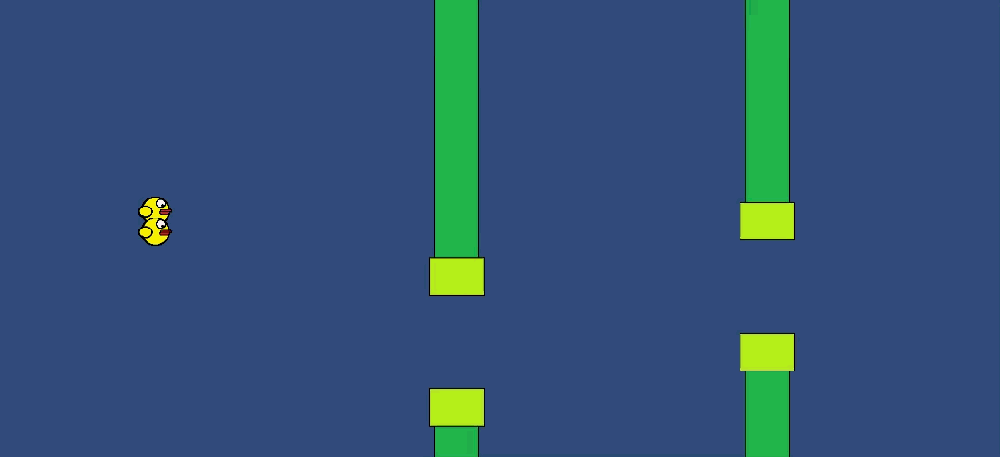

# Flappy Evolved AI

A rudimentary Unity implementation of an evolving population of
Flappy Bird-playing agents. A hundred birds are deployed per generation, and
the longest lasting pass their genes into the next generation.

## Running it

Built with **Unity 6000.4.3f1**. Open the project folder in Unity and play
`Assets/Scenes/Main.unity` — the game and AI scripts are in `Assets/Scripts`.

---

Originally written in 2020 as a personal project while learning Unity, and
reopened in a current Unity version to record the clip above, which took a few
small API updates along the way.
